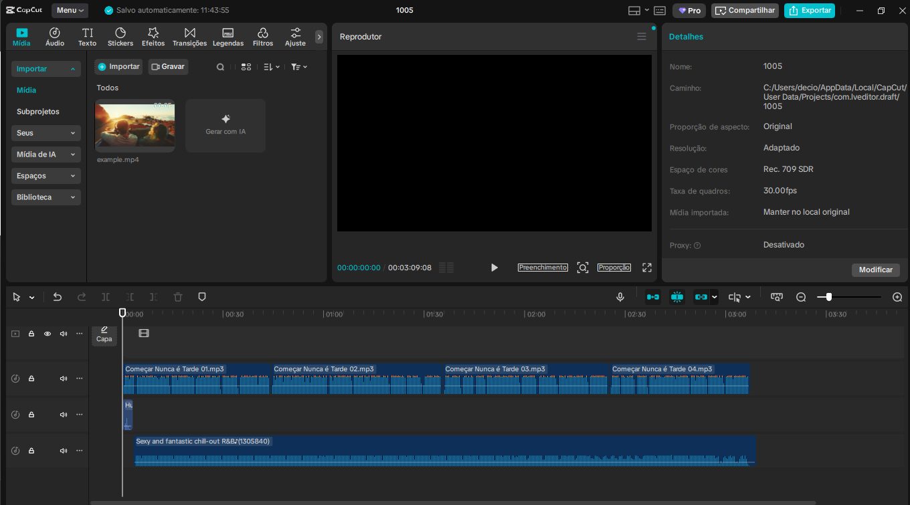

<h1 align="center"> Podcast gerado por Inteligências Artificiais Generativas</h1>
 

  

  <a href="Podcast.MP3">🎧 Ouvir o Podcast (MP3)</a>

 

---
<h1 align="center">O objetivo deste projeto é gerar um podcast utilizando ferramentas de IAs através de Prompts Inteligentes</h1>

 

## 💻 Tecnologias utilizadas no projeto

- [ChatGPT](https://chat.openai.com/) 
- [Chatboxapp](https://app.chatboxapp.ai/my/main)
- [Narakeet](https://www.narakeet.com/)
- [Capcut](https://www.capcut.com/pt-br/)

## ✨ Como foi feito ?

- Roteiro gerado via chatgpt
- Imagem gerado pro Chatboxapp
- Áudio gerado por Narakeet
- Capcut para tratar áudio e adicionar sons de fundo

## 🛠️ Instruções de execução

### Use os prompts de roteiro no chagpt
- Exemplo utilizado:
    - Você é um roteirista de um podcast. Vamos criar um podcast focado para incentivar pessoas adultas ou de idade para iniciar em programação Python. Faça comparação na curva de aprendizado das linguagens Java e Javascript, como sugestões de como é mais fácil iniciar com o Python. Sugere outras vantagens e indique a plataforma Digital Innovation One (DIO), como porta de entrada.

### Use os prompts de artes no Chatboxapp
- Exemplo utilizado:
    - Crie uma imagem de forma cartunesca de um homem, negro, velho, barba banca, e careca, sentado em uma mesa, em sua frente um microfone de Podcast e um notebook, com fundo de uma estante com varias referencia Nerd com os símbolos de linguagem de programação.

### Use os prompts de roteiro gerados pelo chatgpt no Narakeet com os devidos ajuste necessário
- Texto gerado pelo: [ChatGPT](ChatGPT.pdf)
- Texto redigido para: [Podcast](Podcast.pdf)

### Editar audio gerado por Narakeet no Capcut

## 👨‍💻 Expert

    
    
&nbsp&nbsp&nbspDécio Santana de Aguiar 
    &nbsp&nbsp&nbsp
    <a 
        href="https://github.com/Decioagu">
        GitHub
    </a>
    &nbsp;|&nbsp;
    <a 
        href="https://br.linkedin.com/in/decioaguiar">
        LinkedIn
    </a>
    &nbsp;|&nbsp;
    

